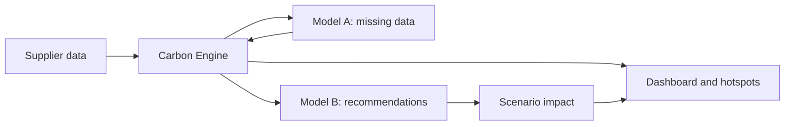

<div align="center">

# Carbonix

### Make Scope 3 emissions visible, auditable, and actionable.

Carbon-aware supply chain intelligence for teams that need to find emissions hotspots, understand their suppliers, and act on credible reduction opportunities.

<p>
  <a href="https://react.dev/"></a>
  <a href="https://fastapi.tiangolo.com/"></a>
  <a href="https://www.python.org/"></a>
  <a href="https://www.sqlite.org/"></a>
  <a href="https://github.com/PalashKulkarni/Carbonix-Hackout"></a>
</p>

</div>

---

## At a glance

| | |
| --- | --- |
| **Focus** | Multi-tier Scope 3 supply chain emissions |
| **Source of truth** | Deterministic Carbon Engine |
| **Intelligence** | Peer-group imputation and recommendation ranking |
| **Experience** | Dashboard, map, scenarios, reports, and chat |
| **Built with** | React, FastAPI, SQLAlchemy, SQLite, and scikit-learn |

<div align="center">

**Ingest data**  →  **Calculate emissions**  →  **Find hotspots**  →  **Model action**  →  **Report with confidence**

</div>

## Contents

- [Why Carbonix](#why-carbonix)
- [What it does](#what-it-does)
- [How it works](#how-it-works)
- [Architecture](#architecture)
- [Quick start](#quick-start)
- [Password-reset email](#password-reset-email)
- [Benchmarks](#benchmarks)
- [Documentation](#documentation)

## Why Carbonix

Supply chain emissions are often the largest and least visible part of a company's carbon footprint. Supplier data is incomplete, spread across tiers, and difficult to compare. Carbonix turns that fragmented input into an auditable workflow:

- map supplier relationships across Tier 1, Tier 2, and Tier 3
- calculate emissions from traceable activity data and configurable factors
- identify the suppliers and activities with the greatest impact
- estimate missing activity data while clearly labeling modeled values
- test sourcing changes before recommending them

The system uses machine learning to assist with incomplete data and rank options. Official emissions and scenario impacts remain grounded in the deterministic Carbon Engine.

## What it does

### Understand the footprint

- CSV, manual, and demo supplier data ingestion
- Multi-tier supply chain hierarchy visualization
- Emissions across energy, transport, materials, manufacturing, and logistics
- Supplier, category, tier, and risk breakdowns
- Geographic hotspot map with MapLibre

### Decide what to change

- Circular sourcing recommendations with projected CO2e reduction
- What-if scenarios for recycled materials, renewable energy, and rail transport
- Supplier rankings and impact-focused prioritization
- Model A peer-group estimation for missing activity values
- Model B recommendation generation and ranking

### Communicate the result

- Dashboard KPIs and historical trends
- Supply chain chatbot for dataset questions
- ESG report export with rankings, breakdowns, hotspots, and recommendations
- Password-reset email flow for local development

## How it works



1. **Ingest:** supplier records are organized into a multi-tier dependency tree.
2. **Calculate:** the Carbon Engine applies `Activity Data x Emission Factor = CO2e`.
3. **Complete:** Model A estimates missing values using comparable suppliers and production context.
4. **Prioritize:** Model B generates and ranks feasible sourcing scenarios.
5. **Verify:** each scenario is evaluated again by the Carbon Engine before its impact is shown.

## Architecture

```text
engine/    Deterministic calculations, factors, scenarios, risk, and audit logic
backend/   FastAPI API, persistence, authentication, reporting, and model adapters
frontend/  React, TypeScript, and Vite dashboard
docs/      API, architecture, data model, ML, and product documentation
```

### Design principle

Machine learning helps Carbonix fill gaps and rank choices; it does not invent official carbon totals. The calculation path is deterministic, traceable, and testable.

## Tech stack

| Layer | Technology |
| --- | --- |
| Frontend | React, TypeScript, Vite, Recharts, React Flow, MapLibre GL |
| Backend | FastAPI, Pydantic, Python |
| Database | SQLite, SQLAlchemy, Alembic |
| Data and ML | scikit-learn, peer-group estimators, custom rankers |

## Quick start

### Prerequisites

- Python 3.9 or newer
- Node.js and npm

### 1. Start the backend

From the repository root:

```powershell
cd backend
..\.venv\Scripts\python.exe -m pip install -e "."
..\.venv\Scripts\python.exe -m uvicorn app.main:app --reload --host 127.0.0.1 --port 8000
```

The API docs will be available at <http://127.0.0.1:8000/docs>.

### 2. Start the frontend

In a second terminal:

```powershell
cd frontend
npm ci
npm run dev -- --host 127.0.0.1 --port 5173
```

Open <http://127.0.0.1:5173/> in your browser. The frontend defaults to the local API.

### 3. Run the tests

From `backend/`:

```powershell
..\.venv\Scripts\python.exe -m pytest
```

## Password-reset email

For local Gmail delivery, copy `backend/.env.example` to `backend/.env` and set:

- `SMTP_USERNAME`
- a Gmail App Password
- `FRONTEND_URL`

Never commit or share `backend/.env`. Carbonix uses the authenticated `SMTP_USERNAME` as the sender address. Reset links expire after 30 minutes and can be used only once.

## Benchmarks

| Component | Result |
| --- | --- |
| Model A energy estimation | 60% lower error than the baseline |
| Model A inference latency | 0.030 ms |
| Model B NDCG@3 | 0.9996 |
| Model B top-1 accuracy | 97.67% |
| Carbon Engine golden and invariant tests | 54/54 passed |

## Documentation

| Topic | Link |
| --- | --- |
| API contract | [`docs/API_CONTRACT.md`](docs/API_CONTRACT.md) |
| Architecture | [`docs/ARCHITECTURE.md`](docs/ARCHITECTURE.md) |
| Carbon Engine | [`docs/CARBON_ENGINE.md`](docs/CARBON_ENGINE.md) |
| Data model | [`docs/DATA_MODEL.md`](docs/DATA_MODEL.md) |
| Machine learning | [`docs/ML.md`](docs/ML.md) |
| ML benchmarks | [`docs/ML_BENCHMARKS.md`](docs/ML_BENCHMARKS.md) |
| Product scope | [`docs/PRODUCT.md`](docs/PRODUCT.md) |

## Team

Built at DAU HackOut '26 by:

- Palash Kulkarni
- Khush Patel
- Anvesh Anand Pol
- Harshil Dhameliya

<div align="center">

**Carbonix** — clearer carbon data, better supply chain decisions.

</div>