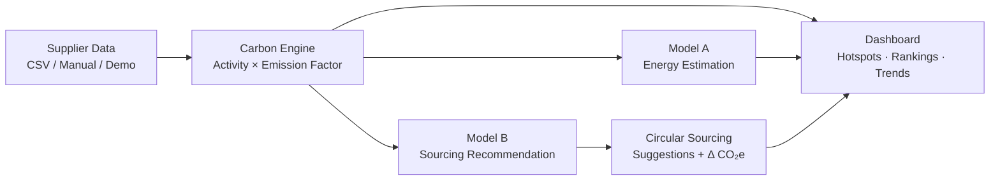
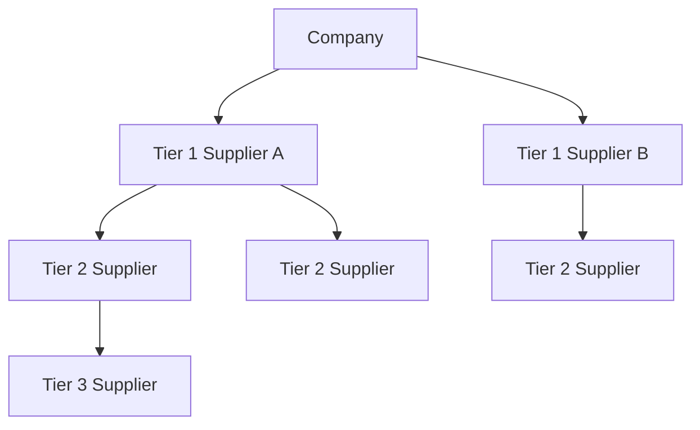

<div align="center">

# 🌱 Carbonix

### Carbon-Aware Supply Chain Dashboard

**Theme: Circular Carbon Ecosystem** · Built for **DAU Hackout'26**


</div>

---

##  Overview

Companies increasingly need to report and reduce **Scope 3 (supply chain) emissions** — but most lack the tools to trace carbon impact across multi-tier suppliers.

**Carbonix** ingests supplier-level data (energy use, transport distances, materials, production volume) and calculates an **aggregated, auditable carbon footprint** across the entire supply chain. It highlights the highest-impact nodes, ranks suppliers by risk and intensity, and recommends circular sourcing alternatives to cut emissions — all backed by a validated calculation engine and two production-grade ML models.

##  Who It's For

- Corporate sustainability teams
- Supply chain managers
- ESG auditors
- Suppliers

##  Why It Matters

- Improves the **accuracy and transparency** of Scope 3 emissions reporting
- Helps companies **identify and prioritize** the highest-impact reduction opportunities
- Supports **compliance** with growing ESG disclosure requirements

---

##  Features

### Core

- **Supplier Data Ingestion** — CSV upload, manual entry, or demo dataset (supplier name, tier, material, quantity, energy consumed, electricity source, transport distance/mode, location, production volume)
- **Carbon Emission Calculator** — computes CO₂e from energy, transportation, material, manufacturing, and logistics activity data (`Activity Data × Emission Factor = CO₂e`)
- **Emission Factor Database** — configurable factors for materials (steel, aluminium, plastic, cement), energy sources, and transport modes
- **Supply Chain Hierarchy** — tree/network visualization of multi-tier supplier relationships (Company → Tier 1 → Tier 2 → Tier 3)
- **Carbon Hotspot Identification** — ranks and sorts suppliers/activities by emissions to surface the biggest contributors
- **Carbon Dashboard** — total CO₂e, total suppliers, emissions by supplier/category/tier, and hotspot summary
- **Supplier Emission Breakdown** — per-supplier drill-down across energy, transport, materials, and manufacturing
- **Supplier Carbon Ranking** — leaderboard with rank, supplier, total CO₂e, emission intensity, and carbon risk

### High Priority

- **Carbon Hotspot Map** — MapLibre geographic heatmap weighted by supplier emissions, risk-colored supplier markers, and optional driving-route overlay with distance and transport CO₂e
- **Circular Sourcing Recommendations** — e.g. virgin → recycled materials, grid → renewable energy, air → sea/rail transport, imported → local sourcing, with estimated CO₂e reduction
- **What-If / Scenario Simulator** — adjust recycled material %, renewable energy %, rail transport % and see projected emissions, absolute and percentage reduction

### Additional

- **Supply Chain Chatbot** — conversational querying of the dataset (highest emitters, tier breakdowns, comparisons, scenarios)
- **Historical Emission Trends** — tracks total, supplier, category, and tier emissions over time
- **ESG Report Export** — auto-generated PDF with executive summary, rankings, breakdowns, hotspots, and recommendations

>  All of the above are fully implemented in this build.

---

##  Architecture

Carbonix is built around three core computational components:

| Component | Role |
|---|---|
| **Carbon Engine** | Deterministic calculation engine — converts activity data into auditable CO₂e figures |
| **Model A** | ML estimation model — predicts energy consumption where direct data is unavailable |
| **Model B** | ML recommendation model — ranks and surfaces the best circular sourcing alternatives |





---

##  Preview

> *Drop in actual product screenshots or a demo GIF here — e.g.:*

```


```

| View | What it shows |
|---|---|
|  Dashboard | Total CO₂e, emissions by supplier/tier/category, live hotspots |
|  Hotspot Map | Suppliers plotted geographically, node size = emissions |
|  Scenario Simulator | Slide recycled %, renewable %, rail % → see projected CO₂e drop |
|  Supplier Ranking | Leaderboard by total CO₂e, intensity, and carbon risk |

---

##  Tech Stack

| Layer | Technology |
|---|---|
| Frontend | React, TypeScript, Vite, Tailwind CSS, React Router, Recharts, React Flow, MapLibre |
| Backend | FastAPI, Pydantic, Python |
| Database / ORM | SQLite by default, SQLAlchemy, Alembic |
| ML | Custom-trained estimation & recommendation models |

---

##  Benchmark Results (Live Run)

| Component | Metric | ML / System | Baseline | Result |
|---|---|---|---|---|
| **Model A** | MAE (energy_kwh) | 5,556 kWh | 13,733 kWh | ✅ **−60%** |
| **Model A** | Inference latency | 0.030 ms | — | ✅ |
| **Model B** | NDCG@3 | 0.9996 | 0.9937 | ✅ |
| **Model B** | Top-1 Accuracy | 97.67% | 93.02% | ✅ **+4.7 pp** |
| **Model B** | E2E latency | ~8 ms/call | — | ✅ |
| **Carbon Engine** | Golden/Invariant tests | 54/54 passed | N/A | ✅ |
| **Carbon Engine** | Latency | 0.030 ms/call | — | ✅ |

**Highlights:**
- Model A cuts energy estimation error by **60%** over baseline, at sub-millisecond inference.
- Model B achieves near-perfect ranking quality (NDCG@3 of 0.9996) and **97.67%** top-1 recommendation accuracy.
- The Carbon Engine passes all 54 golden/invariant tests, confirming calculation correctness and auditability, with negligible latency.

---

##  Get it running locally now !

### Prerequisites

- Python 3.9 or newer
- Node.js and npm

### Backend

```powershell
cd backend
..\.venv\Scripts\python.exe -m pip install -e "."
..\.venv\Scripts\python.exe -m uvicorn app.main:app --reload --host 127.0.0.1 --port 8000
```

The backend creates and seeds the default local SQLite database at startup. Set `DATABASE_URL` to use another SQLAlchemy database. The API health check and interactive docs are available at `http://127.0.0.1:8000/health` and `http://127.0.0.1:8000/docs`.

### Frontend

In a second terminal:

```powershell
cd frontend
npm ci
npm run dev -- --host 127.0.0.1 --port 5173
```

Open `http://127.0.0.1:5173/`. During local development, the frontend uses the API at `http://127.0.0.1:8000`.

---

## 👨‍💻 Team

Built at **DAU HackOut'26** by:

- Palash Kulkarni
- Khush Patel
- Anvesh Anand Pol
- Harshil Dhameliya

---

<div align="center">

**Carbonix** — making Scope 3 emissions visible, auditable, and actionable. 🌍

</div>
